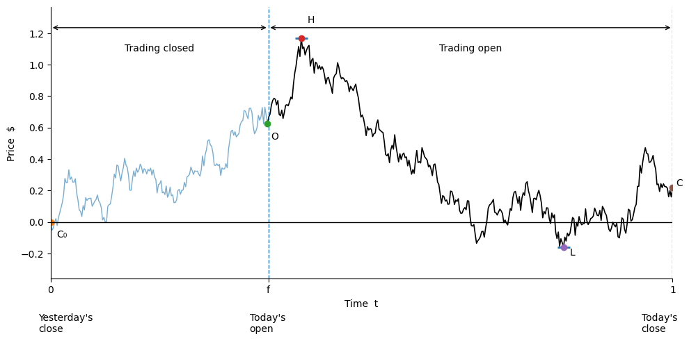

# Volatility Paper Code

Import required packages


```python
from __future__ import annotations
import numpy as np
import pandas as pd
import matplotlib.pyplot as plt
import math
from dataclasses import dataclass
from typing import Dict, Optional, Tuple, List
```

Plot Figure for Paper


```python

# parameters
seed = 100
N = 480                # points over the day
f = 0.35               # open fraction in [0,1]
rng = np.random.default_rng(seed)

# simulate a simple Brownian-like path
t = np.linspace(0, 1, N)
dt = 1 / (N - 1)
x = np.concatenate([[0.0], np.cumsum(np.sqrt(dt) * rng.standard_normal(N - 1))])

# pick open, high, low, close
i_open = int(f * (N - 1))
seg = x[i_open:]
iH = i_open + np.argmax(seg)
iL = i_open + np.argmin(seg)

C0 = x[0]
O  = x[i_open]
H  = x[iH]
L  = x[iL]
C  = x[-1]

fig, ax = plt.subplots(figsize=(10, 5))

# closed vs open periods
ax.plot(t[:i_open+1], x[:i_open+1], lw=1, alpha=0.6)
ax.plot(t[i_open:], x[i_open:], lw=1.2, color="black")

# vertical dashed lines for open and close
ax.axvline(f, ls="--", lw=1)
ax.axvline(1, ls="--", lw=1)

# small horizontal ticks at H and L
tick_w = 0.02
ax.hlines(H, t[iH]-tick_w/2, t[iH]+tick_w/2, lw=2)
ax.hlines(L, t[iL]-tick_w/2, t[iL]+tick_w/2, lw=2)

# point markers
ax.plot(t[0], C0, "o")
ax.plot(t[i_open], O, "o")
ax.plot(t[iH], H, "o")
ax.plot(t[iL], L, "o")
ax.plot(t[-1], C, "o")

# labels for points
ax.annotate("C₀", (t[0], C0), xytext=(t[0]+0.01, C0-0.1))
ax.annotate("O",  (t[i_open], O), xytext=(t[i_open]+0.005, O-0.1))
ax.annotate("H",  (t[iH], H), xytext=(t[iH]+0.01, H+0.1))
ax.annotate("L",  (t[iL], L), xytext=(t[iL]+0.01, L-0.05))
ax.annotate("C",  (t[-1], C), xytext=(t[-1]+0.005, C+0.01))

# x-axis ticks and labels
ax.set_xticks([0, f, 1])
ax.set_xticklabels(["0", "f", "1"])
ax.axhline(0, lw=1, color="black")

# bottom captions
ax.annotate("Yesterday's\nclose", (0, 0), xytext=(-0.02, -0.7))
ax.annotate("Today's\nopen", (f, 0), xytext=(f-0.03, -0.7))
ax.annotate("Today's\nclose", (1, 0), xytext=(1-0.05, -0.7))

# top timeline arrows
ax.annotate("", xy=(0, ax.get_ylim()[1]), xytext=(f, ax.get_ylim()[1]),
            arrowprops=dict(arrowstyle="<->"))
ax.annotate("", xy=(f, ax.get_ylim()[1]), xytext=(1, ax.get_ylim()[1]),
            arrowprops=dict(arrowstyle="<->"))
ax.text(0.5*f, ax.get_ylim()[1]-0.1, "Trading closed", ha="center", va="top")
ax.text((1+f)/2, ax.get_ylim()[1]-0.1, "Trading open", ha="center", va="top")

# axis labels
ax.set_ylabel("Price  $")
ax.set_xlabel("Time  t")

# cosmetics
ax.set_xlim(0, 1)
ax.margins(y=0.15)
ax.spines["top"].set_visible(False)
ax.spines["right"].set_visible(False)

plt.tight_layout()
plt.savefig("simple_OHLC_diagram.png", dpi=300, bbox_inches="tight")
plt.show()
```


    

    


# plt.savefig("gk_style_chart.png", dpi=300)Utility Functions


```python
def _safe_log(x: np.ndarray) -> np.ndarray:
    """Numerically safe natural log."""
    return np.log(np.clip(x, 1e-300, None))

def _require_columns(df: pd.DataFrame, cols: List[str]) -> None:
    missing = [c for c in cols if c not in df.columns]
    if missing:
        raise ValueError(f"DataFrame missing required columns: {missing}")

@dataclass
class EstimatorResults:
    """Container for per‑day estimates and an aggregate scalar."""
    per_day: pd.Series
    aggregate: float
```

Functions for Classical Estimators


```python
def cc_variance(df: pd.DataFrame) -> EstimatorResults:
    """
    Close‑to‑close (CC): per day r_t^2 with r_t = ln(C_t/C_{t-1}).
    Aggregate = mean of daily r^2.
    """
    _require_columns(df, ["Close"])
    close = df["Close"].to_numpy(float)
    r = _safe_log(close[1:] / close[:-1])
    per_day = pd.Series(np.concatenate([[np.nan], r**2]), index=df.index, name="CC")
    return EstimatorResults(per_day=per_day, aggregate=float(np.nanmean(per_day)))

def parkinson_variance(df: pd.DataFrame) -> EstimatorResults:
    """
    Parkinson (1980): (1/(4 ln 2)) * [ln(H/L)]^2 per day; aggregate = mean.
    """
    _require_columns(df, ["High", "Low"])
    hl = _safe_log(df["High"].to_numpy(float) / df["Low"].to_numpy(float))
    per_day = pd.Series((hl**2) / (4.0 * math.log(2.0)), index=df.index, name="PK")
    return EstimatorResults(per_day=per_day, aggregate=float(np.nanmean(per_day)))

def garman_klass_variance(df: pd.DataFrame) -> EstimatorResults:
    """
    Garman–Klass practical (no drift):
      0.5 * [ln(H/L)]^2  - (2 ln 2 - 1) * [ln(C/O)]^2
    """
    _require_columns(df, ["Open", "High", "Low", "Close"])
    O, H, L, C = (df[c].to_numpy(float) for c in ["Open", "High", "Low", "Close"])
    h_l = _safe_log(H / L)
    c_o = _safe_log(C / O)
    per_day = pd.Series(0.5*h_l**2 - (2.0*math.log(2.0) - 1.0)*c_o**2,
                        index=df.index, name="GK")
    return EstimatorResults(per_day=per_day, aggregate=float(np.nanmean(per_day)))

def rogers_satchell_variance(df: pd.DataFrame) -> EstimatorResults:
    """
    Rogers–Satchell (drift‑robust) per day:
      u*(u - c) + d*(d - c) where u=ln(H/O), d=ln(L/O), c=ln(C/O).
    """
    _require_columns(df, ["Open", "High", "Low", "Close"])
    O, H, L, C = (df[c].to_numpy(float) for c in ["Open", "High", "Low", "Close"])
    u = _safe_log(H / O); d = _safe_log(L / O); c = _safe_log(C / O)
    per_day = pd.Series(u*(u - c) + d*(d - c), index=df.index, name="RS")
    return EstimatorResults(per_day=per_day, aggregate=float(np.nanmean(per_day)))

def yang_zhang_variance(df: pd.DataFrame, alpha: float = 1.34) -> EstimatorResults:
    """
    Yang–Zhang multi‑period:
      V = VO + k*VC + (1 - k)*VRS, with
      VO = sample var of o_i = ln(O_i / C_{i-1})
      VC = sample var of c_i = ln(C_i / O_i)
      VRS = mean of RS_i (per‑day RS term)
      k = (alpha - 1) / (alpha + 1 + 2/(n - 1))
    Returns per_day = RS component (for plotting) and aggregate scalar V.
    """
    _require_columns(df, ["Open", "High", "Low", "Close"])
    O, H, L, C = (df[c].to_numpy(float) for c in ["Open", "High", "Low", "Close"])
    C_prev = np.concatenate([[np.nan], C[:-1]])
    o = _safe_log(O / C_prev)  # overnight; first NaN
    c = _safe_log(C / O)
    u = _safe_log(H / O); d = _safe_log(L / O)
    rs = u*(u - c) + d*(d - c)

    mask = ~np.isnan(o); n = int(mask.sum())
    if n < 2: raise ValueError("Need ≥2 periods for YZ.")
    VO = float(np.var(o[mask], ddof=1))
    VC = float(np.var(c[mask], ddof=1))
    VRS = float(np.mean(rs[mask]))
    k = (alpha - 1.0) / (alpha + 1.0 + 2.0/(n - 1.0))
    V = VO + k*VC + (1.0 - k)*VRS

    return EstimatorResults(per_day=pd.Series(rs, index=df.index, name="YZ_component_RS"),
                            aggregate=V)

```

NULL Space Framework


```python
def null_space_basis(K: np.ndarray, tol: float = 1e-12) -> np.ndarray:
    """
    Orthonormal basis for Null(K).  K: (#constraints × #terms).
    """
    U, S, VT = np.linalg.svd(K, full_matrices=True)
    r = (S > tol).sum()
    V = VT.T
    m = K.shape[1]
    return np.zeros((m, 0)) if r == m else V[:, r:]

def particular_solution(K: np.ndarray, target: np.ndarray) -> np.ndarray:
    """Minimum‑norm particular solution a_p to K a = target via pseudoinverse."""
    return np.linalg.pinv(K) @ target

def optimal_weights_from_nullspace(
    K: np.ndarray,
    target: np.ndarray,
    Pi: np.ndarray,
    B: Optional[np.ndarray] = None,
    a_p: Optional[np.ndarray] = None,
) -> Tuple[np.ndarray, Dict[str, np.ndarray]]:
    """
    Solve:  minimize a^T Π a  s.t. K a = target
    using a = a_p + B α with B basis of Null(K).
    α* = −(B^T Π B)^{-1} B^T Π a_p,   a* = a_p + B α*
    """
    if a_p is None: a_p = particular_solution(K, target)
    if B is None:   B   = null_space_basis(K)
    if B.size == 0:
        return a_p, {"B": B, "a_p": a_p, "alpha_star": np.zeros(0)}
    BT_Pi_B = B.T @ Pi @ B
    BT_Pi_ap = B.T @ Pi @ a_p
    alpha_star = -np.linalg.solve(BT_Pi_B, BT_Pi_ap)
    a_star = a_p + B @ alpha_star
    return a_star, {"B": B, "a_p": a_p, "alpha_star": alpha_star}
```

Monte Carlo Simulation


```python
def simulate_bm_day_extremes(n_paths: int = 100_000, n_steps: int = 1_000,
                             seed: Optional[int] = 42) -> Dict[str, np.ndarray]:
    """
    Simulate Brownian motion (µ=0, σ=1) over [0,1]; open O=0.
    Return arrays for u=H-O, d=L-O, c=C-O (O=0 baseline).
    """
    rng = np.random.default_rng(seed)
    dt = 1.0 / n_steps
    dB = rng.normal(0.0, math.sqrt(dt), size=(n_paths, n_steps))
    X = np.cumsum(dB, axis=1)
    H = X.max(axis=1)
    L = X.min(axis=1)
    C = X[:, -1]
    return {"u": H, "d": L, "c": C}

def empirical_covariance_matrix(x_terms: np.ndarray) -> np.ndarray:
    X = np.asarray(x_terms)
    Xc = X - X.mean(axis=0, keepdims=True)
    return (Xc.T @ Xc) / (X.shape[0] - 1)

def ohlc_nullspace_optimal_weights_monte_carlo(
    n_paths: int = 50_000, n_steps: int = 1_000, seed: Optional[int] = 123
) -> Dict[str, float]:
    """
    OHLC quadratic family:
      x = [u^2, d^2, c^2, u d, u c, d c]^T
    Constraint: unbiased ⇒ K a = 1 with K = [E[x_i]] (estimated here by MC).
    Π is the empirical covariance of x.

    Returns weights dict keyed by ["u2","d2","c2","u_d","u_c","d_c"].
    """
    sim = simulate_bm_day_extremes(n_paths=n_paths, n_steps=n_steps, seed=seed)
    u, d, c = sim["u"], sim["d"], sim["c"]
    X = np.column_stack([u**2, d**2, c**2, u*d, u*c, d*c])
    K = X.mean(axis=0, keepdims=True)
    target = np.array([1.0])
    Pi = empirical_covariance_matrix(X)
    a_star, _ = optimal_weights_from_nullspace(K, target, Pi)
    terms = ["u2", "d2", "c2", "u_d", "u_c", "d_c"]
    return {t: float(w) for t, w in zip(terms, a_star)}

```


```python
simulate_bm_day_extremes()
```


    {'u': array([0.17332315, 0.3078732 , 1.0762915 , ..., 0.51201986, 1.16433007,
            0.14081993], shape=(100000,)),
     'd': array([-1.24817266, -2.71597722, -0.28576105, ..., -0.46634444,
            -0.01246639, -2.57252966], shape=(100000,)),
     'c': array([-0.91363106, -2.57340953,  1.06572567, ..., -0.12888533,
             1.16433007, -2.33397952], shape=(100000,))}


```python

```
